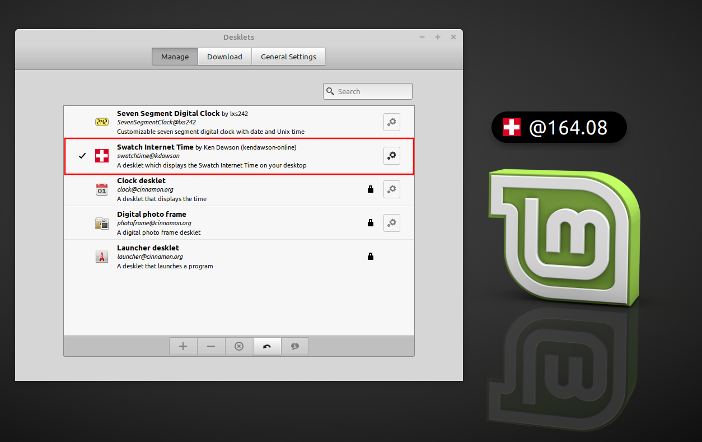
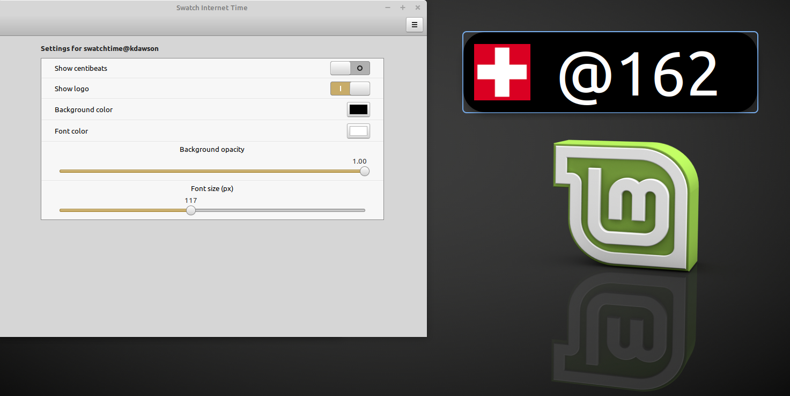
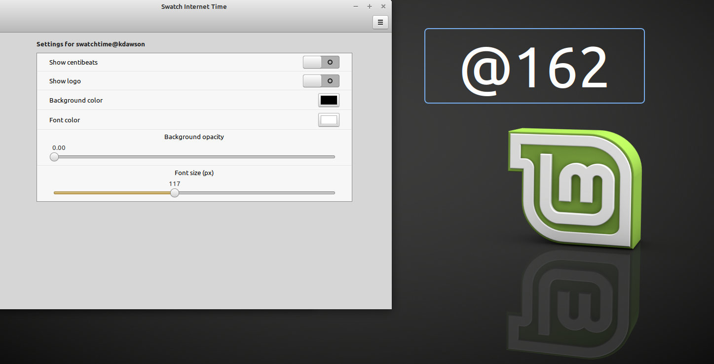
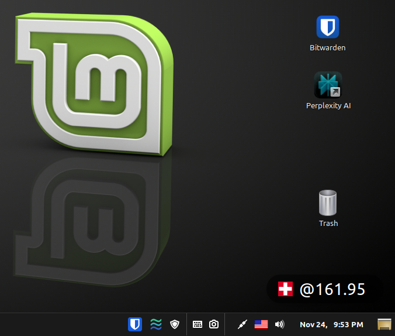

# Swatch Internet Time Desklet

**version 1.0**

This [Cinnamon](https://cinnamon-spices.linuxmint.com/desklets) desklet displays the Swatch Internet Time in "beats". Swatch Internet Time is a decimal time concept introduced by the Swatch corporation in 1998. It divides the day into 1,000 "beats" instead of hours, minutes, and seconds. Each beat is equivalent to 1 minute and 26.4 seconds. The day starts at midnight BMT (Biel Mean Time, UTC+1). You can learn more about Swatch Internet Time here:

- https://www.swatch.com/en-us/internet-time.html

- https://en.wikipedia.org/wiki/Swatch_Internet_Time

## Features:

- Displays Swatch Internet Time in beats
- Display centibeats (e.g. @000.00)
- Adjustable background color and opacity
- Adjustable font-size
- Show or hide the logo
- Place it anywhere on your desktop

## Screenshots:

---

---

---

## Author:

Ken Dawson (https://github.com/kendawson-online)

## License:

[MIT License](LICENSE)

## Developer Info:

Linux Mint: https://linuxmint.com

Cinnamon: https://cinnamon-spices.linuxmint.com

GitHub: https://github.com/swatchtime/cinnamon-desklet

Tested and developed on Linux Mint Debian Edition (LMDE) 7 using Cinnamon 6.4.13

  

### Disclaimer:

This is a fan-made revival and is not affiliated with or endorsed by Swatch Group.

  

Last updated: Nov. 24, 2025